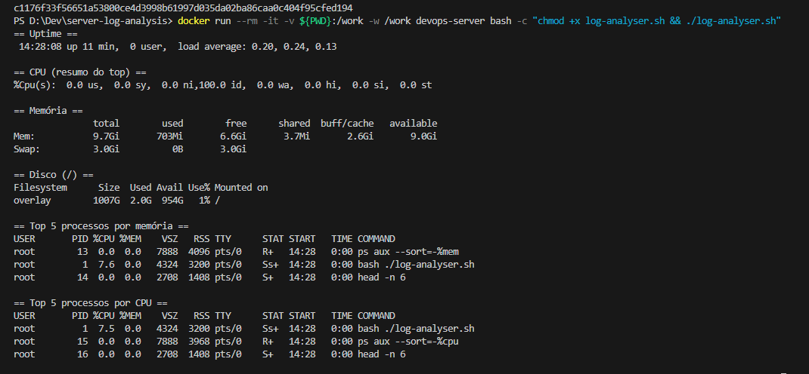

# server-log-analysis

Este projeto cria um ambiente Linux minimalista em Docker, acessível por SSH, para executar scripts de análise de performance (CPU, memória, disco e uso de processos).

A ideia surgiu de um cenário real do meu trabalho, e esta versão é uma forma simplificada da solução que implementei na prática para diagnosticar gargalos em pipelines.
Durante o processamento de apólices, alguns jobs no Databricks apresentaram lentidão significativa e os tempos de ingestão aumentaram mais de 40%. Eu precisava entender rapidamente se a causa era o código Spark ou um gargalo no servidor que hospedava os processos. Montei uma versão simples deste ambiente Linux para medir CPU/memória, inspecionar processos concorrentes e analisar logs diretamente via SSH. Identifiquei que um job com um bug no loop ao processar as linhas do arquivo estava consumindo CPU intensivamente e interferindo na execucao. Apos ajustado o codigo nao houveram mais gargalos

## Uso rápido

Build:
```bash
docker build -t devops-server .

docker run -d -p 2222:22 -e DEVOPS_PASSWORD=umaSenhaSegura --name devops-server devops-server
```

